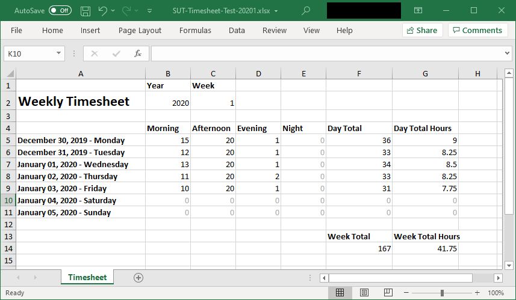

# SUT
> The Service Unit Tracker is a speciales Windows Forms based time sheet utility aimed at automatically capturing the number of Service Units (one service unit equaling 15 minutes) spent working logged into a workstation. This tool is being written to fit my specific needs to easily track time without any third party operated services.

## Installation

TODO

1. Install [.NET Framework 4.8 Runtime](https://dotnet.microsoft.com/download/dotnet-framework/net48) or higher.
2. // TODO: for v1.00

## Usage example

1. Run the application and let it run in the background.
2. Generate weekly Excel based report.

## Development setup

Windows:
1. Install your favourite Integrated development environment (IDE) for C# e.g. [Visual Studios Community](https://visualstudio.microsoft.com/vs/community/) or [Jetbrains Rider](https://www.jetbrains.com/rider/).

2. With an IDE installed, ensure that you have the [.NET Framework 4.8](https://dotnet.microsoft.com/download/dotnet-core/2.0).

3. If you haven't already install [Git](https://git-scm.com/downloads) and/or your perferred Git client e.g. [Github Desktop](https://desktop.github.com/) to gain access to the code.

4. Fork this repository and get clone the repository.

Note: After cloning the repository you will have the `master` branch checked out. This is likely not the most recent version of the code. You will want to checkout a branch. Check the Projects for the In Progress

5. Using your IDE, open the project's `.sln` file. This will open the project within your IDE. Once open in the IDE, you are ready to go.

## Contributing

1. Fork it (<https://github.com/albertmorvay/SUT/fork>)
2. Create your feature branch (`git checkout -b feature/fooBar`)
3. Amend CHANGELOG.md following instructions within the file
4. Commit your changes (`git commit -am 'Add some fooBar'`)
5. Push to the branch (`git push origin feature/fooBar`)
6. Create a new Pull Request
